# Jonathan Gonzalez — Mobile Development Portfolio

Senior Mobile Engineer specializing in **iOS development**, with experience building, maintaining, and modernizing production mobile applications across **fintech, logistics, enterprise, healthcare, and consumer products**.

My work spans native **iOS (Swift / Objective-C)** and **Android (Java)** development, with particular experience in legacy modernization, offline functionality, location services, application stability, and production delivery.

---

## TrackIt

**IT Team Lead / Mobile Developer**  
**May 2023 – November 2025**

**Platforms:** iOS, Android  
**Tech:** Swift, Objective-C, Java, UIKit, MapKit, Core Location, NFC, BLE, Firebase, REST APIs, Gradle, CocoaPods

TrackIt is a mobile workforce and asset-management platform used to manage jobs, tasks, equipment, field operations, and location tracking.

  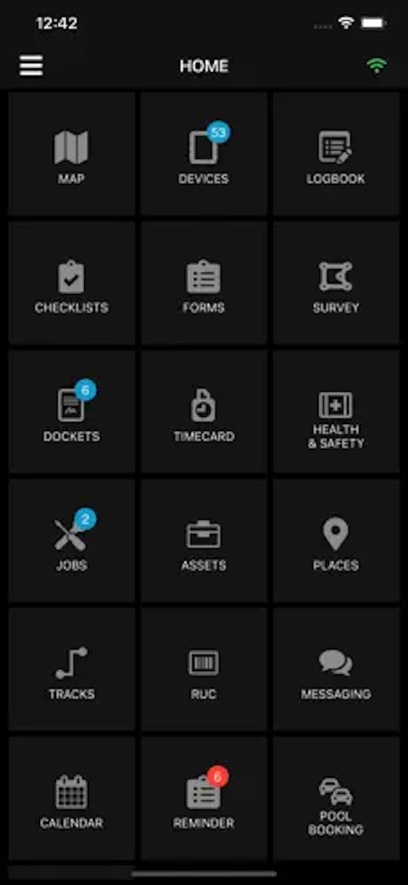
  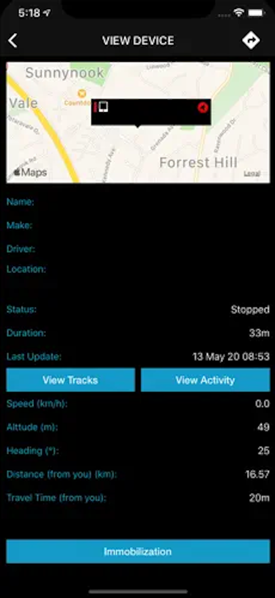
  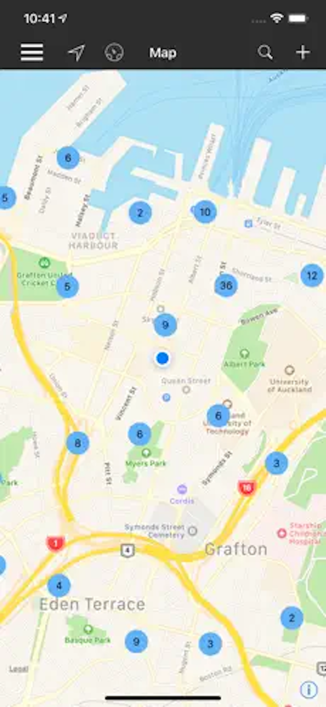
  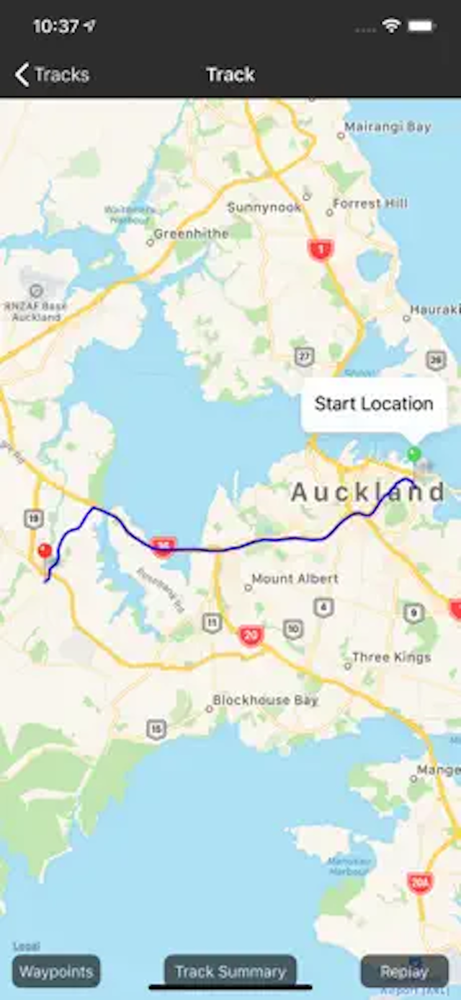

### What I worked on

- Maintained and modernized production **iOS and Android** applications.
- Improved **geolocation, mapping, routing, and tracking** functionality.
- Worked with **Bluetooth-connected equipment, BLE, NFC, Firebase, and background services**.
- Diagnosed and resolved crashes, concurrency problems, and issues within a large legacy codebase.
- Implemented UX improvements and client-requested features.
- Maintained offline functionality and local data handling for field use.
- Managed production releases through the **Apple App Store and Google Play Store**.

**Links:**  
[TrackIt NZ — App Store](https://apps.apple.com/ie/app/trackit-nz/id815505614)  
[TrackIt — Google Play](https://play.google.com/store/apps/details?id=nz.co.trackit.android&hl=en_ZA)

---

## ING Philippines — Digital Bank

**Senior iOS Developer**  
**October 2018 – December 2022**

**Platform:** iOS  
**Tech:** Swift, Objective-C, UIKit, REST APIs, Face ID, XCTest, XCUITest, Azure DevOps, CI/CD

ING Philippines was a mobile-first digital bank providing savings accounts, payments, onboarding, check deposits, transfers, and consumer lending.

  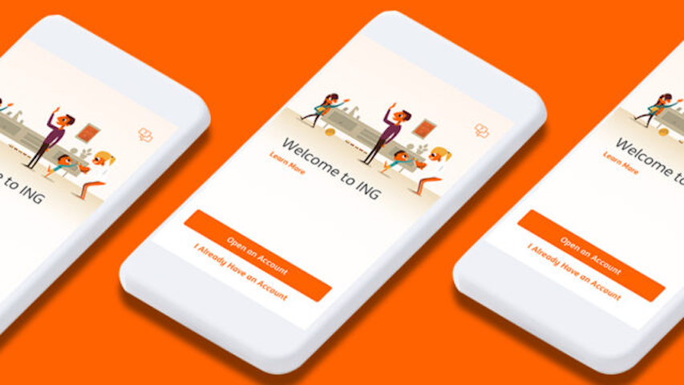
  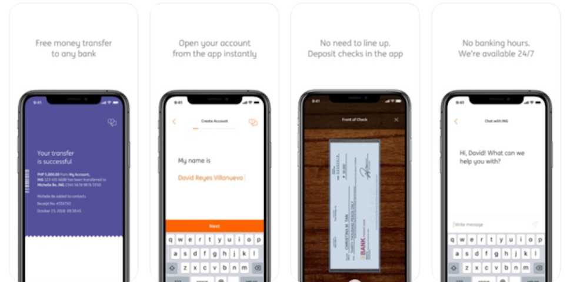

### What I worked on

- Developed and maintained customer-facing functionality for the production iOS banking application.
- Worked on **authentication, security, and Face ID-related functionality**.
- Supported a hybrid native/web application architecture.
- Worked on an **over-the-air update mechanism** that allowed selected web resources to be updated without requiring a complete App Store release.
- Contributed to **unit testing, UI testing, production support, and issue resolution**.
- Used **Azure DevOps** for source control, work tracking, build pipelines, and CI/CD.
- Collaborated within a cross-functional Agile engineering team.

**Link:**  
[ING Philippines — Video](https://www.youtube.com/watch?v=X-QlOQgwtb8&list=PLiEa9j0acA-5kETWIjnMrXpvCfWgUwK4A)

---

## Titan Access

**iOS Developer**  
**July 2016 – September 2017**

**Platform:** iOS  
**Tech:** Objective-C, iOS

Titan Access is a field operations application supporting the lifecycle of construction hoarding projects, including quoting, installation, modifications, removals, health and safety, quality assurance, and engineering compliance.

### What I worked on

- Developed and maintained native iOS functionality.
- Supported field-based construction and compliance workflows.
- Worked with application data that needed to remain accessible in field environments.
- Contributed to functionality designed for use where network connectivity could be unreliable.

**Link:**  
[Titan Hoarding Systems — Google Play](https://play.google.com/store/apps/details?id=com.buckhamduffy.titan&hl=en_US&gl=US&pli=1)

---

## AroundAbout Live

**iOS Developer**  
**October 2015 – November 2015**

**Platform:** iOS  
**Tech:** Objective-C, Location Services, Mapping

AroundAbout Live was a location-based discovery application for finding nearby restaurants, bars, clubs, activities, and venues.

  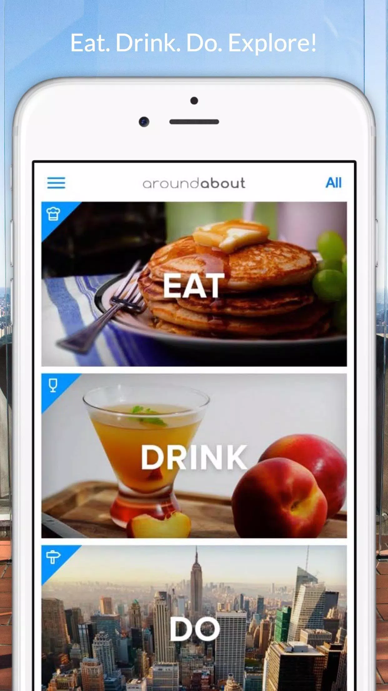
  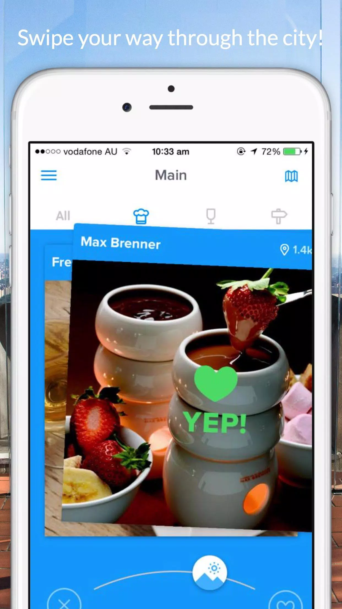
  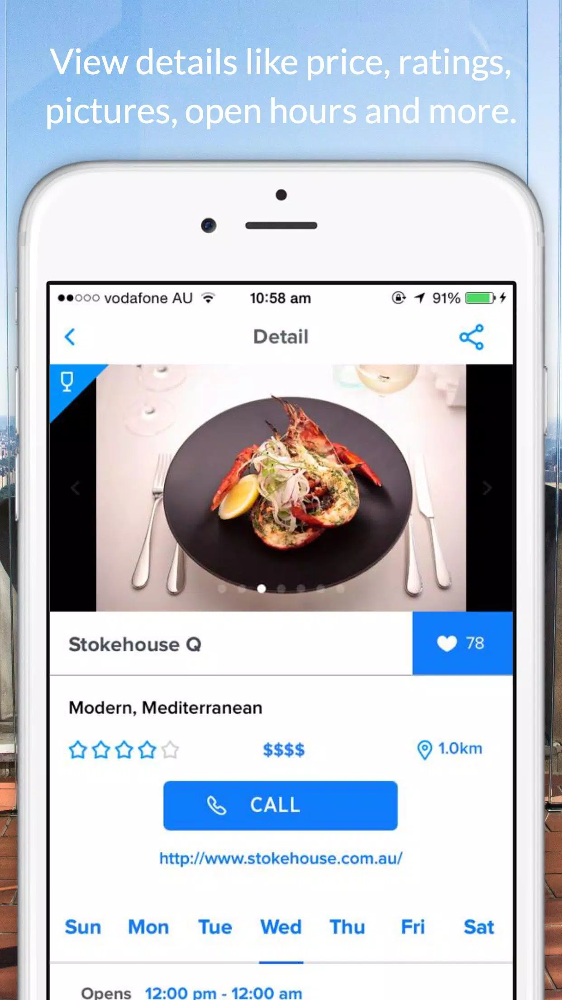
  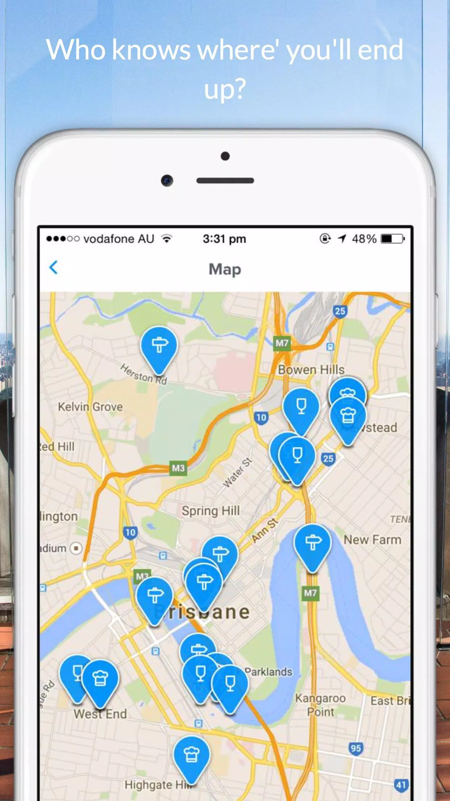
  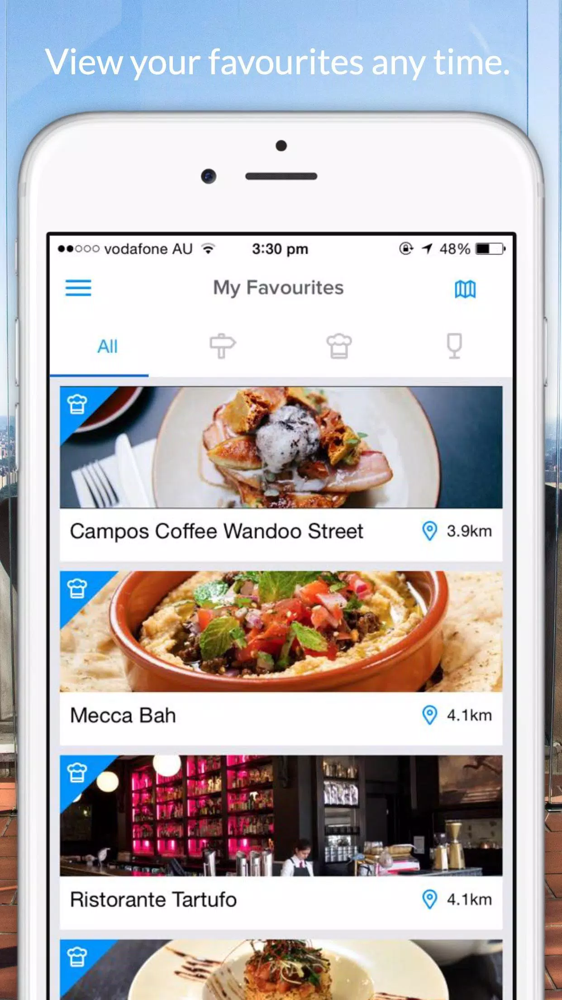

### What I worked on

- Developed native iOS functionality.
- Worked with **location and mapping services**.
- Contributed to the application's gesture-driven, card-based discovery interface.
- Implemented functionality around venue discovery, ratings, and favorites.

**Link:**  
[AroundAbout Live — Archived Listing](https://m.apkpure.com/aroundabout-live/com.appster.aroundabout)

---

## PeriCoach

**iOS Developer**  
**January 2015 – March 2015**

**Platform:** iOS  
**Tech:** Objective-C, Device Integration

PeriCoach was a companion application for a physical sensor device used for pelvic-floor training and formed part of a Class I medical-device system.

  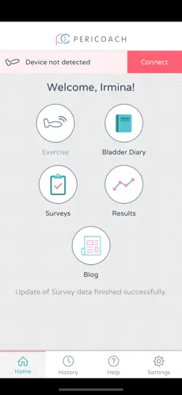
  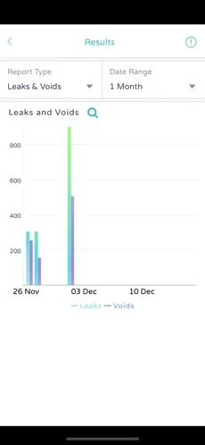
  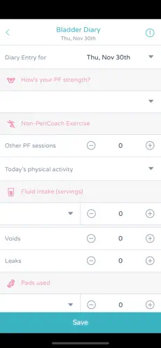

### What I worked on

- Worked on communication and interaction with a connected physical sensor.
- Improved exercise visualization and usability.
- Improved application reliability around device-driven functionality.
- Developed within the requirements of a medical-device ecosystem.

**Link:**  
[PeriCoach — App Store](https://apps.apple.com/ph/app/pericoach/id933204028?uo=4&mt=8)

---

## Chuzi Mix

**iOS Developer**  
**September 2014 – October 2014**

**Platform:** iOS  
**Tech:** Objective-C

Chuzi was a matchmaking application built around a **"Spin and Admire"** interaction model rather than a conventional swipe interface.

### What I worked on

- Developed and maintained native iOS functionality.
- Implemented interactive matchmaking features.
- Worked on custom user-interface interactions and application behavior.

**Link:**  
[Chuzi — Archived App Listing](https://androidappsapk.co/detail-chuzi/)

---

## DiscoverForever

**iOS Developer**  
**March 2014 – April 2014**

**Platform:** iOS  
**Tech:** Objective-C, Salesforce, Offline Data

DiscoverForever provided Forever Business Owners with mobile access to training resources, product information, and business-development materials.

### What I worked on

- Joined as one of the initial iOS developers.
- Implemented **offline media browsing and caching**.
- Integrated mobile functionality with Salesforce-backed services.
- Improved usability when operating with limited or unavailable connectivity.

**Link:**  
[DiscoverForever — App Store](https://apps.apple.com/us/app/discover-forever/id855643762?ign-mpt=uo%3D4)

---

## RateMySuper

**iOS Developer**  
**June 2013 – August 2013**

**Platform:** iOS  
**Tech:** Objective-C, Salesforce, PDF Generation, Charts

RateMySuper was an Australian financial-product comparison application that allowed users to compare products through side-by-side views, charts, graphs, and generated reports.

### What I worked on

- Contributed from initial design through production deployment.
- Developed **side-by-side financial product comparison interfaces**.
- Implemented charts and data visualization.
- Implemented **dynamic PDF report generation**.
- Integrated application functionality with Salesforce services.

**Link:**  
[RateMySuper — Demo Video](https://www.youtube.com/watch?v=g_y0_cL16Io)

---

## Cricket Live Australia

**iOS Developer**  
**October 2012 – January 2013**

**Platform:** iOS

Cricket Live Australia provided live cricket coverage including video streaming, highlights, scores, ball-by-ball commentary, news, and player information.

During the 2012–2013 cricket season, the application exceeded **one million downloads**.

  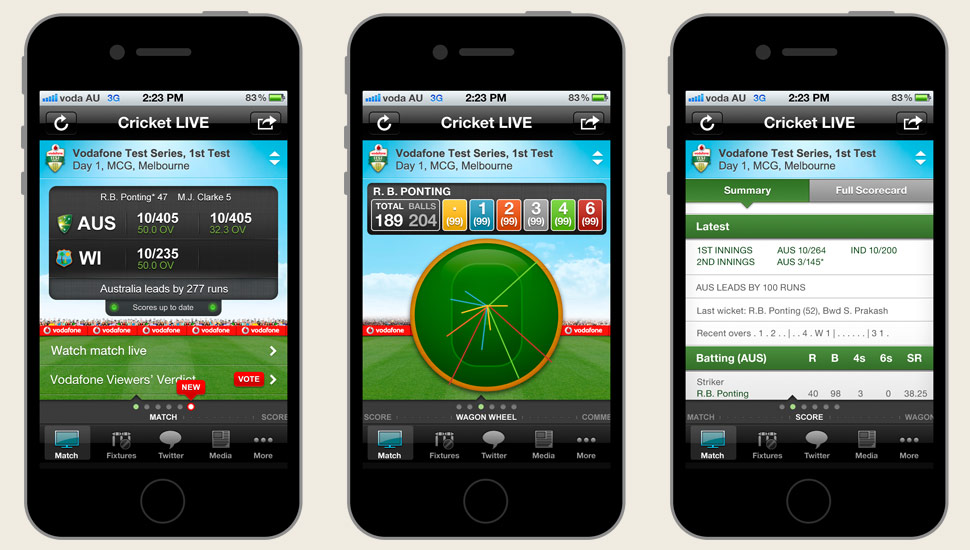

### What I worked on

- Contributed to development of the production iOS application.
- Worked within a high-traffic consumer mobile product.
- Contributed to an application delivering real-time sports content during the Australian cricket season.

**Link:**  
[Cricket Live Australia — Project Archive](https://monteboyd.com/cricket_live.html)

---

## DocBox

**iOS Developer**  
**May 2012 – July 2012**

**Platform:** iPad / iOS  
**Tech:** Objective-C, Salesforce, Offline Caching, PDF

DocBox was an enterprise iPad application providing mobile access to documents and sales collateral stored through Salesforce.

It allowed field sales teams to access, present, annotate, organize, and share documents while retaining access to important content when connectivity was limited.

  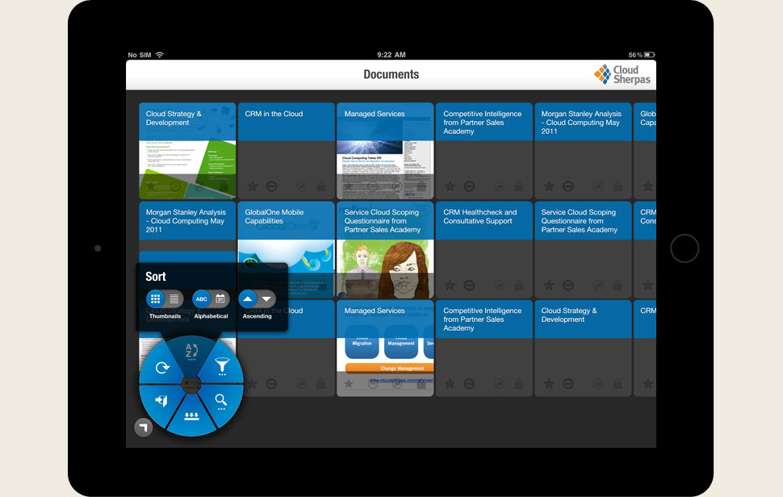
  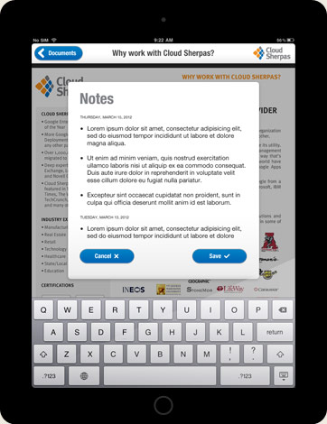

### What I worked on

- Developed native iPad functionality.
- Integrated application functionality with **Salesforce**.
- Worked on **offline document caching and management**.
- Supported PDF presentation and viewing.
- Implemented document sorting, filtering, notes, and sharing functionality.

**Link:**  
[DocBox — Project Archive](https://monteboyd.com/docbox.html)

---

## DME

**Mobile Developer — Symbian / iOS**  
**April 2011 – December 2011**

**Platforms:** Symbian, iOS  
**Tech:** Symbian C++, Objective-C, iOS, Mobile Security

DME was an enterprise mobility platform providing secure access to corporate data and services across multiple mobile platforms.

I initially worked on the **Symbian client** before transitioning to the iOS development team.

  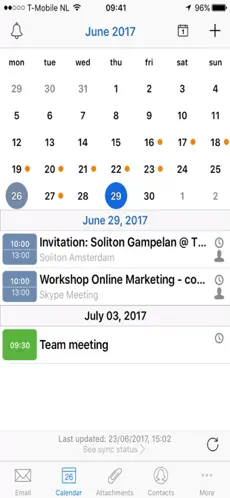
  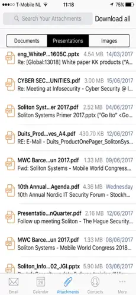
  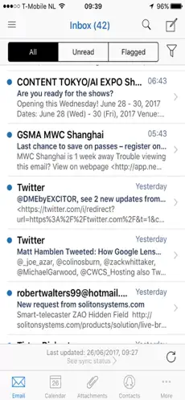

### What I worked on

- Maintained and enhanced an established enterprise mobile security application.
- Implemented bug fixes, enhancements, and UI functionality for the Symbian client.
- Developed **location-related functionality** for iOS.
- Implemented **file association functionality** on iOS.
- Transitioned professionally from Symbian C++ development into Objective-C/iOS development.
- Received technical training in Denmark covering iOS development and the DME iOS client.

**Link:**  
[DME 4 — App Store](https://apps.apple.com/au/app/dme-4/id323836140?ign-mpt=uo%3D4)

---

## Core Technologies

**iOS:** Swift, Objective-C, UIKit, SwiftUI, Core Data, MapKit, Core Location, CoreBluetooth, NFC

**Android:** Java, Android SDK, Gradle

**Architecture:** MVVM, MVC, Clean Architecture, Offline-First Architecture

**Backend & Services:** REST APIs, Firebase, Salesforce

**Testing:** XCTest, XCUITest, Unit Testing, UI Testing

**DevOps & Tools:** Git, Azure DevOps, CI/CD, CocoaPods

**Specialized Experience:** Offline data, location tracking, mapping, BLE, NFC, mobile security, legacy modernization, production troubleshooting

---

## About Me

I've been developing software professionally since **2004** and working with iOS since **2011**.

Much of my career has involved stepping into existing applications, understanding complex or legacy codebases, diagnosing problems, and making them more reliable and maintainable.

I particularly enjoy solving difficult production problems, improving application architecture and stability, and working with product teams and stakeholders to turn real-world requirements into practical technical solutions.
